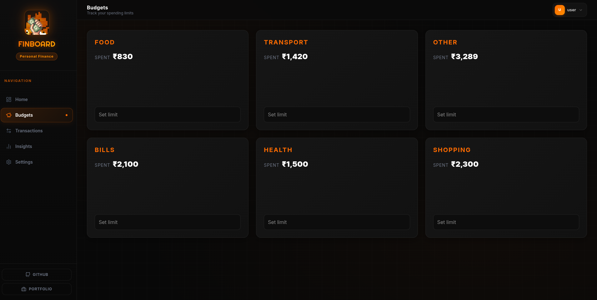
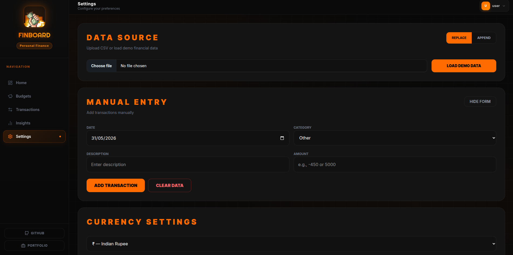

<h1 align="center">
  
  <a href="https://finnboard0.netlify.app/">FinBoard</a>
</h1>

<p align = "center">
FinBoard is a retro-themed personal finance dashboard that empowers users to manage budgets, monitor transactions, analyze spending trends through interactive visualizations, and stay on top of their financial goals—all securely from the browser.
</p>


<div align="center">

### 📊 Interactive Dashboard

Monitor your financial health at a glance with powerful visualizations, detailed spending insights, and an easy-to-navigate dashboard experience.

</div>

___

<table>
  <tr>
    <td width="50%">
      <h3>💰 Budget Management</h3>
      <p>
        Set spending limits, track your expenses in real time, and monitor your financial goals with ease.
        Stay in control of your budget and make smarter spending decisions.
      </p>
    </td>
    <td width="50%">
      
    </td>
  </tr>
</table>

___

<table>
  <tr>
    <td width="50%">
      
    </td>
    <td width="50%">
      <h3>📜 Transaction History</h3>
      <p>
        Gain complete visibility into your finances with a detailed transaction history.
        Quickly search, filter, and categorize records to better understand your spending habits
        and maintain full control over your financial journey.
      </p>
    </td>
  </tr>
</table>

___

<table>
  <tr>
    <td width="50%">
      <h3>🧠 Insights</h3>
      <p>
        📊 Get a complete overview of your financial health with smart insights and spending analytics.<br>
        💰 Instantly understand savings, expenses, and income trends to make better money decisions.<br>
        📈 Identify top spending categories and track monthly patterns to improve financial control.
      </p>
    </td>
    <td width="50%">
      
    </td>
  </tr>
</table>

___

<table>
  <tr>
    <td width="50%">
        
    </td>
    <td width="50%">
      <h3>📁 Secure Local Data</h3>
      <p>
        Your financial data stays completely private in your browser — no backend required.<br><br>
        📤 Import your CSV or financial documents effortlessly to analyze your transactions.<br><br>
        💱 Flexible currency support lets you view and manage data in your preferred currency.
      </p>
    </td>
  </tr>
</table>

___


<h1 align="left">
  
   Let's Get Started
</h1>
 
## 🚀 Installation

<h1 align="left">
  
  <a href="https://nodejs.org/en" target="_blank">Node.js</a>
</h1>

1. Clone repository

```bash
git clone https://github.com/khanirfan18/finBoard.git
cd finBoard
```
<br>

2. Install packages

```bash
npm install
```
<br>

3. Start development server

```bash
npm run dev
```

<br>

 <span style="font-size:25px; font-weight:bold;">
🎉 You are all set to run the project.  
Start the server and open it in your browser to explore FinBoard.
</span><br><br>

___


## 🤝 Contributing

Thank you for your interest in contributing to FinBoard! 🚀

Your contributions help improve the project and are greatly appreciated.

### 📘 Before You Start

Please review the following documents before opening an issue or submitting a pull request:

* [Contributing Guide](./CONTRIBUTING.md)
* [Code of Conduct](./CODE_OF_CONDUCT.md)

### 📌 Contribution Guidelines

* Follow the issue creation process outlined in the contribution guide.
* Claim tasks before starting work when required.
* Follow pull request guidelines and project standards.
* Keep contributions aligned with the project's scope and roadmap.

### ⚠️ Important Note

Docker support is part of the long-term roadmap and is currently intended for maintainer use. Docker-related contributions are out of scope unless explicitly requested by a maintainer.

### 💙 Community Expectations

* Be respectful and constructive in discussions.
* Write clear and meaningful issues and pull requests.
* Collaborate professionally with maintainers and contributors.
* Help maintain a welcoming and inclusive environment for everyone.

### 🚀 Happy Building!

Thank you for helping make FinBoard better!
___

## 🚀 Tech Stack

<table border="1" cellpadding="12" cellspacing="0">
  <tr>
    <td>

<table>
  <tr>
    <td align="center" width="220"><b>Frontend</b></td>
    <td>|</td>
    <td>
      
      
    </td>
  </tr>

  <tr>
    <td align="center"><b>Build Tool</b></td>
    <td>|</td>
    <td>
      
    </td>
  </tr>

  <tr>
    <td align="center"><b>Styling</b></td>
    <td>|</td>
    <td>
      
      
    </td>
  </tr>

  <tr>
    <td align="center"><b>Charts</b></td>
    <td>|</td>
    <td>
      
    </td>
  </tr>

  <tr>
    <td align="center"><b>Icons</b></td>
    <td>|</td>
    <td>
      
      
    </td>
  </tr>

  <tr>
    <td align="center"><b>Backend / Database</b></td>
    <td>|</td>
    <td>
      
    </td>
  </tr>

</table>
    </td>
  </tr>
</table>

___


